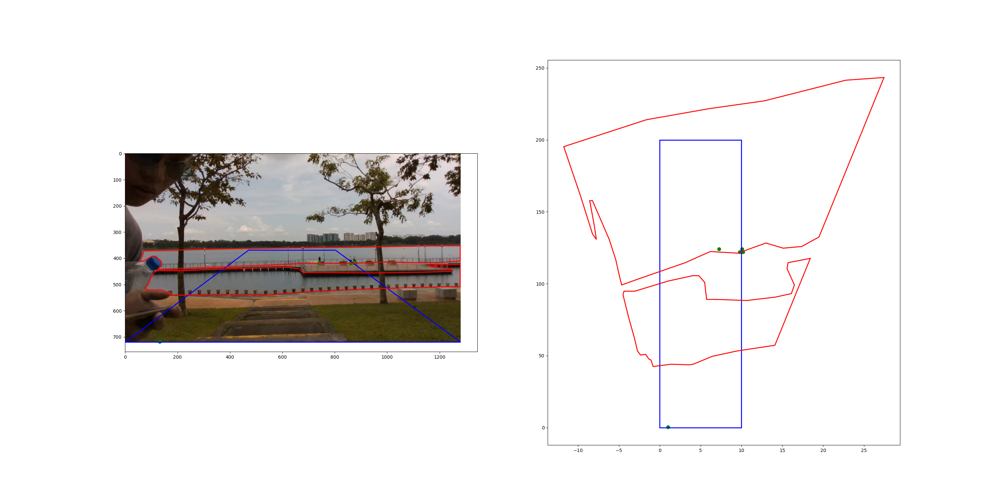

# Introduction
transform the image object to birdview projection.


# Version Note
## 1.0.0
first version
## 1.0.1
add  `__init__.py` into package

# Build
```
python3 setup.py bdist_wheel
```

# Test
```
python3 main.py
```

# Usage
```
from PerspectiveTransform import get_transform, transform_pts, transform_polys, read_json, read_txt
```
